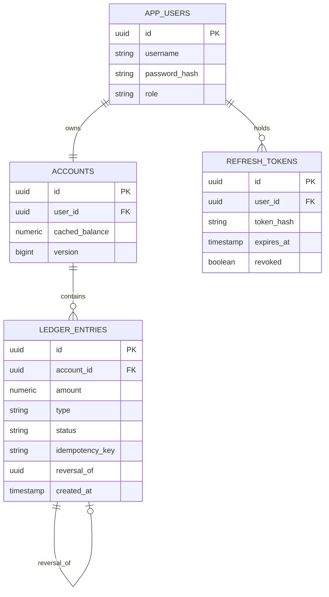

# Fullstack Ledger

A production-oriented **append-only points ledger** built to model the correctness challenges behind rewards, wallet, loyalty, and points-based systems.

The project focuses on the parts that make financial-style state difficult to get right: **concurrent requests, retries, idempotency, reversals, authentication, authorization, auditability, and consistency between cached state and the transaction log.**

---

## Overview

Fullstack Ledger provides a complete web application for managing points associated with user accounts.

The system maintains two representations of an account balance:

- **Ledger entries** — the authoritative source of truth.
- **Cached balance** — an optimized value used for fast reads.

The application is designed so that retries, concurrent requests, duplicate submissions, and reversals cannot silently corrupt the balance.

```text
┌─────────────────────────────────────────────────────────────────┐
│                         React Frontend                          │
│                  React 19 · TypeScript · Tailwind              │
└──────────────────────────────┬──────────────────────────────────┘
                               │ HTTP / REST
                               ▼
┌─────────────────────────────────────────────────────────────────┐
│                         Nginx / API                             │
│                              │                                  │
│                       Spring Boot 3                             │
│                          Java 21                                │
└───────────────┬─────────────────────────────┬───────────────────┘
                │                             │
                ▼                             ▼
┌──────────────────────────┐       ┌─────────────────────────────┐
│      PostgreSQL 16       │       │          Redis 7            │
│                          │       │                             │
│ Source of truth          │       │ Token-bucket rate limiting │
│ Ledger entries           │       │                             │
│ Accounts                 │       │                             │
│ Users                    │       │                             │
│ Refresh tokens           │       │                             │
└──────────────────────────┘       └─────────────────────────────┘
```

---

# Features

## Ledger Correctness

### Append-only transaction history

Ledger entries are never deleted or rewritten.

A mistake is corrected by creating a **compensating reversal entry** linked to the original transaction.

```text
Original Entry
      │
      ▼
CREDIT +500
      │
      │ reversal_of
      ▼
DEBIT -500
```

The original entry can transition from:

```text
POSTED → REVERSED
```

but cannot be modified back or arbitrarily rewritten.

This invariant is additionally enforced at the **PostgreSQL level using a trigger**, preventing application bugs or manual SQL operations from rewriting ledger history.

---

### Audit-based balance verification

The cached balance is treated as a performance optimization, **not the ultimate source of truth**.

The audit endpoint replays the ledger:

```text
Balance = Σ credits - Σ debits
```

and compares the calculated result with the cached account balance.

```text
Ledger
  │
  ├── CREDIT +500
  ├── DEBIT  -100
  ├── CREDIT +250
  │
  ▼
Calculated Balance = 650

Cached Balance = 650

        ↓

      VERIFIED
```

This makes it possible to detect inconsistencies between the transaction history and the cached balance.

---

## Concurrency Control

The application deliberately uses different locking strategies for different workloads.

### Debits — pessimistic locking

Redemptions are the most contention-sensitive operation because multiple requests could attempt to spend the same balance simultaneously.

The account row is locked using:

```sql
SELECT ... FOR UPDATE
```

This serializes competing debits for the same account.

Example:

```text
Balance = 100

Request A → Debit 80
Request B → Debit 80

        Account Row
             │
       ┌─────┴─────┐
       │           │
   Request A   Request B
       │           │
      LOCK       WAIT
       │
    Balance=20
       │
     COMMIT
                   │
                 CHECK
                   │
             Insufficient
                Balance
```

Only one transaction can successfully consume the available balance.

---

### Credits — optimistic locking

Credits use JPA optimistic locking through:

```java
@Version
```

If concurrent updates conflict, the service retries within a bounded limit rather than holding a pessimistic database lock unnecessarily.

This provides a balance between:

- correctness
- concurrency
- database contention

---

### Database-level protection

The database also enforces:

```sql
CHECK (cached_balance >= 0)
```

This provides another layer of protection against negative balances.

The system therefore uses multiple layers of defense:

```text
Application validation
        ↓
Transaction boundaries
        ↓
Pessimistic / optimistic locking
        ↓
Database constraints
        ↓
Audit replay
```

---

# Idempotency

Every mutating ledger request requires an idempotency key.

The key is unique **per account**.

### Same request + same key

Returns the original transaction.

```text
POST /accounts/{id}/debit

Idempotency-Key: abc-123

First request
     ↓
Transaction created
     ↓
200 OK

Retry
     ↓
Same key + same request
     ↓
Original transaction returned
     ↓
200 OK
```

### Same key + different request

The request is rejected:

```text
409 Conflict
```

### Concurrent duplicate requests

Two identical requests arriving simultaneously are resolved using the database's unique constraint rather than relying solely on application-level checks.

The frontend also generates one idempotency key **per user action** and reuses it when retrying that action.

This prevents network retries or double-clicks from creating duplicate transactions.

---

# Reversal Rules

Reversals follow strict invariants:

- An entry can only be reversed once.
- A reversal cannot itself be reversed.
- The original entry is marked `REVERSED`.
- A compensating ledger entry is created.
- Reversing a credit checks the current balance because those points may already have been spent.
- Database constraints prevent multiple reversals of the same entry.

Conceptually:

```text
CREDIT +1000
     │
     ├── User spends 700
     │
     ▼
Balance = 300

Attempt to reverse original +1000
     │
     ▼
Would require -1000
     │
     ▼
Rejected because balance would become negative
```

---

# Security

## Authentication

The application uses:

- JWT access tokens
- 15-minute access-token lifetime
- rotating refresh tokens
- SHA-256 hashed refresh tokens in the database
- refresh-token replay detection
- session-family revocation

Refresh tokens are never stored in plaintext in PostgreSQL.

If an already-used refresh token is replayed, the corresponding session family can be revoked.

---

## Authorization

Account ownership is checked on protected account routes.

Administrative operations require an administrator role.

```text
USER
 ├── View own account
 ├── View own ledger
 └── Redeem own points

ADMIN
 ├── View accounts
 ├── Credit points
 └── Reverse transactions
```

For demonstration and local development, the application also supports:

```text
APP_DEMO_MODE=true
```

which relaxes certain administrative operations to the user's own account.

---

## Password Security

Passwords are protected using:

- BCrypt hashing
- bounded password length compatible with BCrypt
- constant-time-style handling for unknown users using a dummy hash
- authentication rate limiting

---

## Rate Limiting

Two rate-limiting strategies are used.

### Authentication

Authentication endpoints are rate-limited per IP.

### Redemptions

Redemptions are rate-limited per account.

Redis implements the production token bucket using Lua for atomic operations.

If Redis becomes unavailable, the limiter can fail open because **Redis is not part of the ledger's financial correctness boundary**.

PostgreSQL remains responsible for the actual account invariants.

---

# API Error Contract

The API uses a consistent error response structure.

```json
{
  "code": "INSUFFICIENT_BALANCE",
  "message": "Insufficient account balance",
  "requestId": "9c6c4b4d-...",
  "fieldErrors": {}
}
```

The same contract is used across:

- controller errors
- validation errors
- authentication failures
- authorization failures
- framework exceptions
- security filters

See:

[`ledger-service/API_SPEC.md`](ledger-service/API_SPEC.md)

---

# Observability

The backend includes:

- request ID correlation
- structured request logging
- access logging
- Prometheus metrics
- health endpoints
- readiness/liveness checks
- graceful shutdown

Example metric:

```text
ledger_entries_posted_total{type="CREDIT"}
ledger_entries_posted_total{type="DEBIT"}
```

Request IDs are propagated through responses and logs, making it easier to trace a request across the application.

---

# Pagination & Running Balance

Ledger history uses **server-side pagination**.

The running balance is calculated in PostgreSQL using a window function instead of loading the entire transaction history into the frontend.

Conceptually:

```sql
SUM(amount) OVER (
    PARTITION BY account_id
    ORDER BY created_at, id
)
```

This means the frontend does not need to:

1. download the entire ledger
2. recalculate balances
3. keep the complete transaction history in memory

The database performs the calculation close to the source of truth.

---

# Architecture

## Data Model



---

# Redemption Request Flow

A typical redemption follows this path:

```text
Client
  │
  ▼
JWT Authentication Filter
  │
  ▼
Authorization / Ownership Check
  │
  ▼
Redis Rate Limiter
  │
  ▼
LedgerService.debit()
  │
  ├── Acquire account row lock
  │
  ├── Check idempotency key
  │
  ├── Validate balance
  │
  ├── Insert ledger entry
  │
  ├── Update cached balance
  │
  └── Commit transaction
  │
  ▼
Record metrics
  │
  ▼
Return response
```

Metrics are recorded only after the database transaction successfully commits.

---

# Why Cached Balance + Ledger?

The project deliberately separates the **source of truth** from the **read optimization**.

### Alternative

Calculate the balance every time:

```text
Every GET /balance
        ↓
SUM(all ledger entries)
```

This guarantees that the balance comes directly from the log, but becomes increasingly expensive as the ledger grows.

### Current design

```text
Write transaction
     │
     ├── Append ledger entry
     │
     └── Update cached balance
     
Read balance
     │
     └── O(1) cached value
```

The audit endpoint provides an independent consistency check.

This gives fast reads while retaining an auditable transaction history.

---

# Technology Stack

### Frontend

- React 19
- TypeScript
- Tailwind CSS
- Vite
- Vitest
- React Testing Library

### Backend

- Java 21
- Spring Boot 3
- Spring Security
- Spring Data JPA
- Hibernate
- Bean Validation
- Flyway
- OpenAPI / Swagger
- Prometheus / Actuator

### Data & Infrastructure

- PostgreSQL 16
- Redis 7
- Docker
- Docker Compose
- Nginx

### Testing

- JUnit
- Testcontainers
- Vitest
- React Testing Library

---

# Project Structure

```text
fullstack-ledger/
│
├── ledger-service/
│   ├── src/
│   │   ├── main/
│   │   └── test/
│   ├── pom.xml
│   └── API_SPEC.md
│
├── ledger-frontend/
│   ├── src/
│   ├── public/
│   ├── package.json
│   └── vite.config.ts
│
├── db/
│   └── migrations/
│
├── docker-compose.yml
├── Dockerfile
├── .env.example
└── README.md
```

---

# Quick Start

## Prerequisites

For the recommended setup, install:

- Docker
- Docker Compose

No local PostgreSQL or Redis installation is required when running the complete stack with Docker.

---

## 1. Clone the repository

```bash
git clone <repository-url>
cd fullstack-ledger
```

---

## 2. Configure environment variables

Copy the example environment file:

```bash
cp .env.example .env
```

Review the available configuration before starting the application.

For example:

```env
ADMIN_USERNAME=admin
ADMIN_PASSWORD=admin-password-123
JWT_SECRET=<strong-secret-at-least-32-bytes>
APP_DEMO_MODE=false
```

Never commit real secrets to Git.

---

## 3. Start the complete stack

```bash
docker compose up --build
```

The application will start:

| Service | URL |
|---|---|
| Frontend | http://localhost:3000 |
| Backend API | http://localhost:8080 |
| Swagger UI | http://localhost:8080/swagger-ui.html |

---

# Demo Credentials

The default development administrator is:

```text
Username: admin
Password: admin-password-123
```

These values should be overridden through `.env` for any non-local environment.

---

# Using the Application

After starting the application:

### 1. Register

Create a new user account from the frontend.

### 2. Login

Authenticate using the newly created credentials.

### 3. Credit

Administrators can add points to an account.

```text
Account
   ↓
+1000 points
   ↓
Ledger entry created
   ↓
Cached balance updated
```

### 4. Redeem

Redeem points from the account.

The operation verifies:

- authentication
- account ownership
- rate limits
- idempotency
- sufficient balance
- concurrent access

### 5. Reverse

Reverse an eligible transaction.

The system creates a compensating entry rather than rewriting the original transaction.

### 6. Audit

The audit endpoint replays the ledger and verifies the cached balance.

The UI displays the result through the:

```text
Ledger Verified
```

indicator.

---

# Running Without Docker

See the component-specific documentation:

- [`ledger-service/README.md`](ledger-service/README.md)
- [`ledger-frontend/README.md`](ledger-frontend/README.md)

The backend requires PostgreSQL and Redis for the complete configuration.

---

# Testing

The project contains tests at multiple levels.

| Layer | Coverage | Docker |
|---|---|---|
| Backend unit tests | JWT, token bucket, expiry, forgery, tampering, contention | No |
| Backend integration tests | PostgreSQL, concurrency, idempotency, reversals, auth, pagination | Yes |
| Frontend tests | API client, authentication, refresh, UI behavior, idempotency | No |
| Docker smoke test | Full application stack | Yes |

---

## Backend

```bash
cd ledger-service
mvn verify
```

Integration tests use Testcontainers with PostgreSQL.

---

## Frontend

```bash
cd ledger-frontend

npm ci
npm run lint
npm test
npm run build
```

---

# CI/CD

The CI pipeline validates both application layers and the complete deployment stack.

The pipeline performs:

```text
Backend tests
      │
      ▼
Frontend tests
      │
      ▼
Frontend build
      │
      ▼
Docker image build
      │
      ▼
Full Docker stack
      │
      ▼
Smoke tests
```

This helps catch issues that unit tests alone would miss, particularly configuration and service-integration problems.

---

# Engineering Decisions

## Why PostgreSQL is the source of truth?

The ledger represents financial-style state where correctness is more important than eventually consistent reads.

PostgreSQL provides:

- transactions
- row-level locking
- unique constraints
- check constraints
- foreign keys
- triggers
- durable storage

Redis is therefore deliberately kept outside the correctness boundary.

---

## Why pessimistic locking for debits?

Debits compete for the same finite balance.

For example:

```text
Balance = 100

Request A: -80
Request B: -80
```

Without serialization, both requests could observe:

```text
Balance = 100
```

and incorrectly succeed.

The row lock forces the second request to observe the updated balance.

---

## Why optimistic locking for credits?

Credits generally do not have the same insufficient-balance constraint.

Optimistic locking therefore allows concurrent updates without unnecessarily serializing every credit operation.

Conflicts are detected through the entity version and retried within a bounded limit.

---

## Why idempotency keys?

HTTP requests can be retried.

A client may:

```text
Send request
     ↓
Server processes request
     ↓
Network timeout
     ↓
Client retries
```

Without idempotency, the same operation could be executed twice.

Idempotency makes the operation safe to retry.

---

# Known Limitations

This project intentionally does not attempt to implement every feature of a production financial platform.

### Single account per user

The current system supports one account per user.

There is no multi-account transfer system.

A true transfer system would require two-sided postings / double-entry accounting.

---

### Stateless access tokens

Access tokens are stateless.

Therefore, a role change or access revocation takes effect when the current access token expires, currently after 15 minutes.

---

### Refresh token storage

Refresh tokens are stored in browser `localStorage`.

This keeps the demo architecture simple but means a successful XSS attack could potentially access the token.

A production deployment should consider:

```text
HttpOnly
Secure
SameSite
```

cookies for refresh tokens.

---

### Refresh-token rotation across tabs

Strict refresh-token rotation means that using the same refresh token concurrently from multiple browser tabs can trigger replay detection and revoke the session family.

This is an intentional security trade-off.

---

### Account lifecycle

The project does not currently include:

- email verification
- password reset
- account lockout
- expired refresh-token cleanup jobs

---

### Rate limiter fallback

The `no-redis` profile uses an in-memory rate limiter intended for development and testing.

It does not currently evict idle buckets.

---

### Load testing

The system has concurrency tests, but it has not been extensively load-tested.

A future extension would include a k6 workload targeting:

```text
100s / 1000s concurrent requests
        ↓
same account
        ↓
simultaneous debits
        ↓
measure throughput + latency + correctness
```

---

# Future Improvements

Potential next steps include:

- Double-entry accounting
- Multi-account transfers
- HttpOnly refresh-token cookies
- Refresh-token cleanup jobs
- Email verification
- Password reset
- Account lockout policies
- Distributed rate limiting improvements
- k6 load testing
- OpenTelemetry tracing
- Grafana dashboards
- Kubernetes deployment
- Horizontal scaling
- Event-driven ledger consumers
- Outbox/event publishing
- Multi-currency support

---

# Security Notes

This repository is intended as an engineering project and demonstration of ledger correctness patterns.

Before deploying a system handling real monetary value, perform a dedicated security review covering:

- authentication
- authorization
- secret management
- session management
- infrastructure security
- database permissions
- rate limiting
- logging and PII
- dependency vulnerabilities
- threat modeling
- penetration testing
- disaster recovery

Do not use the example development credentials in production.

---

# License

Add the project's license here.

For example:

```text
MIT License
```

if the repository is intended to be released under MIT.

---

## Summary

Fullstack Ledger is primarily an exercise in **correctness under failure**.

The central idea is simple:

```text
                    ┌────────────────────┐
                    │    User Request    │
                    └─────────┬──────────┘
                              │
                              ▼
                    ┌────────────────────┐
                    │ Authentication     │
                    └─────────┬──────────┘
                              │
                              ▼
                    ┌────────────────────┐
                    │ Authorization      │
                    └─────────┬──────────┘
                              │
                              ▼
                    ┌────────────────────┐
                    │ Idempotency        │
                    └─────────┬──────────┘
                              │
                              ▼
                    ┌────────────────────┐
                    │ Concurrency        │
                    │ Control            │
                    └─────────┬──────────┘
                              │
                              ▼
                    ┌────────────────────┐
                    │ PostgreSQL         │
                    │ Transaction        │
                    └─────────┬──────────┘
                              │
                              ▼
                    ┌────────────────────┐
                    │ Append-only Ledger │
                    └─────────┬──────────┘
                              │
                              ▼
                    ┌────────────────────┐
                    │ Audit / Replay     │
                    └────────────────────┘
```

The goal is not simply to make CRUD operations work.

The goal is to make **incorrect state difficult to create, easy to detect, and safe to recover from.**
